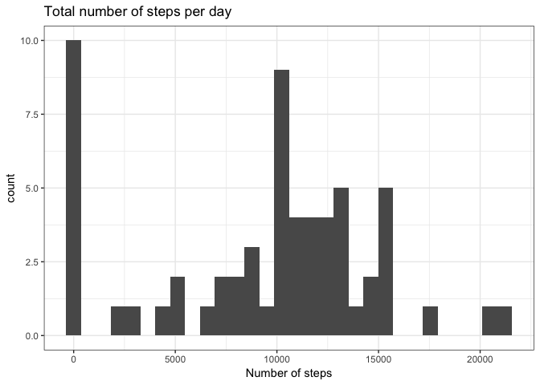
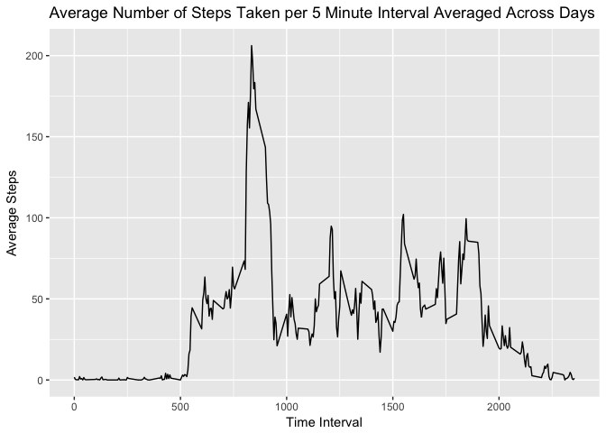
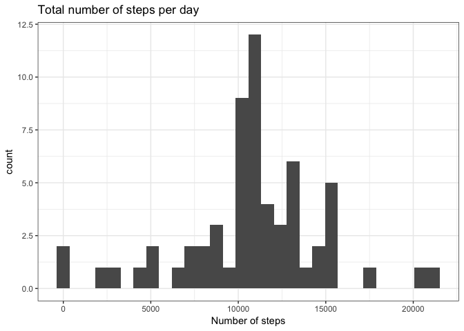
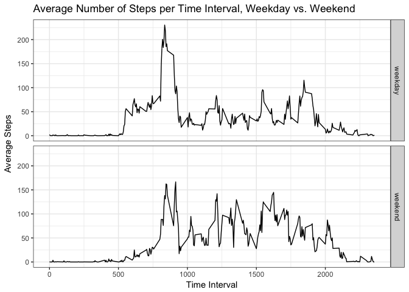

# Reproducible Research: Peer Assessment 1
Alison Henry  


## Loading and preprocessing the data
The first step is to load the needed libraries, then read in the data. This was downloaded as a compressed file when the repository was cloned, but was unzipped into the local directory prior to this writing.


```r
library(plyr)
library(ggplot2)
library(knitr)
actData <- read.csv("activity.csv")
```

## What is mean total number of steps taken per day?
Let's look at a histogram of the daily step count. 


```r
dailySteps <- ddply(actData, .(date), summarize,
        totalSteps = sum(steps, na.rm=TRUE)
        )
ggplot(dailySteps, aes(x=totalSteps)) + geom_histogram() + xlab("Number of steps") + ggtitle("Total number of steps per day") + theme_bw()  
```

```
## `stat_bin()` using `bins = 30`. Pick better value with `binwidth`.
```

<!-- -->

The mean and median number of steps per day are shown as follows.


```r
mean(dailySteps$totalSteps)
```

```
## [1] 9354.23
```

```r
median(dailySteps$totalSteps)
```

```
## [1] 10395
```

## What is the average daily activity pattern?
In which time interval were participants most active? This time series plot shows the mean number of steps taken in each 5 minute interval: 


```r
intervalSteps <- ddply(actData, .(interval), summarize,
        meanSteps = mean(steps, na.rm=TRUE)
        )
ts1 <- ggplot(data=intervalSteps, aes(x=interval, y=meanSteps)) + geom_line() + xlab("Time Interval") + ylab("Average Steps") + ggtitle("Average Number of Steps Taken per 5 Minute Interval Averaged Across Days")
print(ts1)
```

<!-- -->

```r
maxInterval <- subset(intervalSteps, meanSteps == max(meanSteps), select = interval)
```
On average, the 5-minute interval with the highest number of steps is 835.

## Imputing missing values

```r
numNA <- sum(is.na(actData))
```

Our data is missing steps counts for 2304 time intervals. I have chosen to replace these missing values with the mean for that time interval. We can see the difference this makes in the new daily step count histogram.


```r
imputedData <- mutate(actData, steps = replace(steps, is.na(steps), intervalSteps$meanSteps))
dailyStepsImputed <- ddply(imputedData, .(date), summarize,
        totalSteps = sum(steps, na.rm=TRUE)
        )
ggplot(dailyStepsImputed, aes(x=totalSteps)) + geom_histogram() + xlab("Number of steps") + ggtitle("Total number of steps per day") + theme_bw()  
```

```
## `stat_bin()` using `bins = 30`. Pick better value with `binwidth`.
```

<!-- -->

The new mean and median number of steps per day are:


```r
mean(dailyStepsImputed$totalSteps)
```

```
## [1] 10766.19
```

```r
median(dailyStepsImputed$totalSteps)
```

```
## [1] 10766.19
```

Both the mean and median step count values are higher with the inclusion of the imputed data, and the mean is now equal to the median.

## Are there differences in activity patterns between weekdays and weekends?

In order to examine possible differences in activity level on weekends as compared to weekdays, we need to update our data with the days of the week, categorized as weekday or weekend.


```r
imputedData$dayType <- ifelse(weekdays(as.Date(imputedData$date)) %in% c('Saturday','Sunday'), "weekend", "weekday") 
imputedData$dayType <- as.factor(imputedData$dayType)

dayTypeSteps <- ddply(imputedData, .(interval, dayType), summarize, meanSteps = mean(steps))
```

Now we can view the time series for weekdays as compared to weekends:


```r
ggplot(dayTypeSteps, aes(x = interval, y = meanSteps)) + geom_line() + xlab("Time Interval") + ylab("Average Steps") + ggtitle("Average Number of Steps per Time Interval, Weekday vs. Weekend") + facet_grid(dayType ~ .) + theme_bw()
```

<!-- -->

Thanks for reading!
